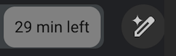
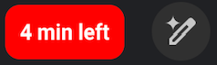

# meet-time-left

## What is this?

It just puts a "N mins left" in the top right with color changing based on how much is left:

## How do i use this?

Clone this repo and then [load as an unpacked extension](https://webkul.com/blog/how-to-install-the-unpacked-extension-in-chrome/)
